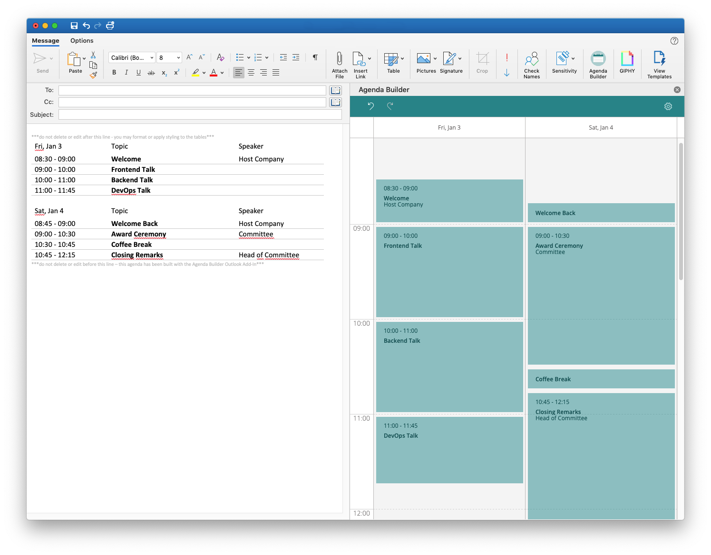

> "An Outlook Add-In to build an agenda."

# Agenda Builder

<p align="center">
  
</p>

## Development

Start development server:

```terminal
npm run dev-server
```

[Sideload add-in for testing](https://docs.microsoft.com/en-us/outlook/add-ins/sideload-outlook-add-ins-for-testing)


## License

MIT © [](https://github.com/)


